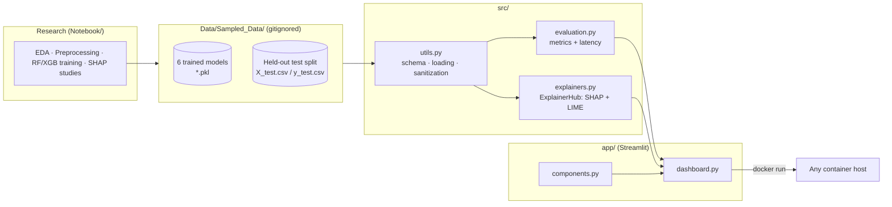

# 🛡️ XAI-IDS — Explainable AI for Network Intrusion Detection

An **Explainable AI–based Intrusion Detection System** built on the **CICIDS2017** dataset.
Tree-ensemble detectors (Random Forest, XGBoost — trained with SMOTE variants for class
balance) are wrapped in a modular Python package, an interactive **Streamlit dashboard**
that explains every alert with **SHAP** and **LIME**, and an automated **CI/CD pipeline**.

**Verified performance** (Random Forest baseline, held-out test flows):
accuracy **0.9987**, F1 **0.9967**, inference **~28 µs/flow**;
local explanations in **~750 ms** (TreeSHAP) and **~200 ms** (LIME).

---

## Architecture



```
├── .github/workflows/ci-cd.yml   # lint → test → docker build
├── app/
│   ├── dashboard.py              # interactive Streamlit dashboard
│   └── components.py             # reusable chart/UI components
├── src/
│   ├── utils.py                  # feature schema, data/model loading, sanitization
│   ├── evaluation.py             # accuracy/F1 + inference latency benchmarking
│   └── explainers.py             # ExplainerHub: SHAP + LIME with latency capture
├── tests/test_core.py            # self-contained unit tests (synthetic CICIDS-shaped data)
├── Notebook/                     # original research notebooks (01–06)
├── Pipeline/data_combination.py  # raw CICIDS2017 CSV merger
├── Dockerfile                    # multi-stage production image
└── requirements.txt
```

---

## Quick start

### 1. Local setup

```bash
git clone <this-repo> && cd Explainable-AI-IDS
python -m venv .venv && source .venv/bin/activate   # Windows: .venv\Scripts\activate
pip install -r requirements.txt
```

The trained models and test split are **not** in git (see `.gitignore`). Either copy an
existing `Data/` directory into the repo root, or regenerate it by running
`Pipeline/data_combination.py` followed by notebooks `02` → `03` → `04`.

### 2. Launch the dashboard

```bash
streamlit run app/dashboard.py
```

Then open http://localhost:8501. The dashboard provides:

- **📊 Global Overview** — accuracy / precision / recall / F1 metric cards, per-flow
  inference latency, confusion matrix, and a global mean-|SHAP| feature-importance chart
  showing what the selected model prioritizes across the whole dataset.
- **🔎 Packet Inspector** — pick any held-out flow (filtered by true ATTACK / BENIGN)
  or manually override its most influential feature values, get a live prediction with
  probability score, then compare a **SHAP waterfall** and a **LIME contribution chart**
  side by side, with an execution-time widget benchmarking the two explainers.

### 3. Run tests & lint

```bash
pytest          # runs on synthetic data; real-data tests auto-skip if Data/ is absent
ruff check src app tests && ruff format --check src app tests
```

### 4. Docker (single-command deployment)

```bash
docker build -t xai-ids .
docker run -p 8501:8501 -v ./Data:/app/Data xai-ids
```

Models are mounted at runtime rather than baked into the image, keeping the image small
and the (large, licensed) dataset out of registries.

---

## XAI methodology

### Why explainability matters in a SOC

A detector that only says *"flow #4182: ATTACK, 99.9%"* is a black box. A Security
Operations Center analyst triaging hundreds of alerts must decide in seconds whether to
escalate, and cannot act on unexplained scores: false-positive fatigue erodes trust, and
regulators increasingly require attributable decisions. Explanations turn an alert into
evidence — *"flagged because backward packet-length variance and destination port are far
outside the benign profile"* — which an analyst can verify against the raw flow and use
in an incident report.

### SHAP — Shapley Additive Explanations

SHAP assigns each feature a contribution based on **Shapley values from cooperative game
theory**: the prediction is treated as a payout, features are players, and each feature's
value is its average marginal contribution across all feature coalitions. Contributions
are guaranteed to sum exactly from the model's base rate to the final prediction
(local accuracy), which makes SHAP waterfall plots auditable.

- For the tree ensembles here, `src/explainers.py` uses **TreeSHAP** — an exact,
  polynomial-time algorithm — and falls back to **KernelSHAP** (over a kmeans-summarized,
  cached background set) for any non-tree model.
- Averaging |SHAP| across many flows yields the **global importance** ranking shown in
  the dashboard's overview tab.

### LIME — Local Interpretable Model-agnostic Explanations

LIME explains one prediction by **fitting a local surrogate model**: it perturbs the
flow's feature values, queries the black-box model on those neighbors, and fits a
weighted sparse linear model in that neighborhood. The surrogate's coefficients — e.g.
`Bwd Packet Length Std <= -0.40 → −0.03 toward ATTACK` — are human-readable decision
rules valid *near this specific flow*.

### SHAP vs LIME, side by side

| | SHAP (TreeSHAP) | LIME |
|---|---|---|
| Foundation | Game theory (Shapley values) | Local linear surrogate |
| Guarantees | Exact, consistent, locally accurate | Approximate, sampling-dependent |
| Scope | Local **and** global | Local only |
| Measured latency (RF, 78 features) | ~750 ms | ~200 ms |

The Packet Inspector renders both explanations for the same flow, so agreement between
the two independent techniques can be used as a confidence signal — a key comparative
question in this research.

### Data handling

CICIDS2017 flow features are numeric after preprocessing (whitespace-stripped headers,
±∞ → NaN → dropped, label-encoded, standard-scaled). `src/utils.py:sanitize_features`
additionally coerces any stray categorical/non-numeric values and re-clips infinities at
inference time, so dirty live-traffic exports cannot crash the serving path. Labels are
binarized to **0 = BENIGN, 1 = ATTACK** to match how the models were trained.

---

## CI/CD

Every push / PR to `main` runs `.github/workflows/ci-cd.yml`:

1. **Lint & format** — `ruff check` + `ruff format --check` enforce style.
2. **Test** — `pytest` on synthetic CICIDS-shaped data (no dataset needed in CI).
3. **Build** — multi-stage Docker image build with GitHub Actions layer caching,
   producing a deployable `xai-ids:<sha>` image.

---

## Author

**Santanu Ojha** — B.Tech, Internet of Things,
University School of Automation and Robotics

*Research goal: a publication-ready Explainable IDS framework combining strong detection
performance with interpretable security insights (SHAP, LIME, and Lens-XAI integration
as the ongoing research contribution).*
